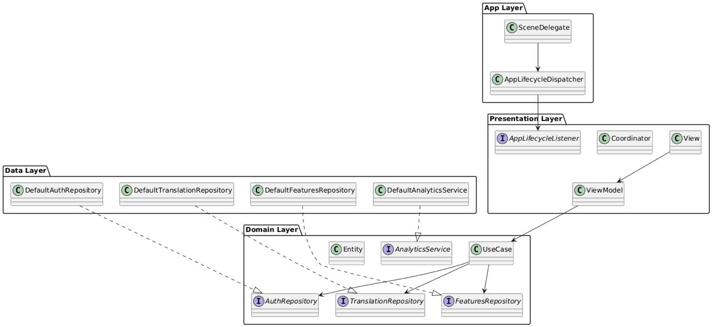

# Transtalor

## Архитектура

**Выбрана:** MVVM + Coordinator + Clean Architecture

**Обоснование:**
- Чёткое разделение ответственности между слоями (Presentation, Domain, Data)
- Высокая тестируемость благодаря протоколам и внедрению зависимостей
- UIKit изолирован в Presentation слое
- Навигация вынесена в Coordinator, освобождая ViewController от этой задачи
- Domain слой не зависит от внешних фреймворков
- Легко масштабировать и поддерживать

---

## Модули

| Модуль | Ответственность |
|--------|------------------|
| **Auth** | Авторизация пользователя и восстановление сессии |
| **Features** | Отображение списка доступных функций переводчика |
| **Translate** | Перевод текста, управление историей и избранным |

---

## Экраны

### Auth

**Вход:**  
**Выход:** `onAuthorized(UserSession)`

**Сценарии:**
- Ввод email/password → успех → переход к списку фич
- Ошибка авторизации → отображение ошибки
- Восстановление сессии при запуске

---

### Features

**Вход:** `UserSession`  
**Выход:** `openFeature(FeatureType)`

**Сценарии:**
- Загрузка списка доступных фич
- Обработка offline-доступности
- Выбор фичи → переход к Translate

---

### Translate

**Вход:** `UserSession`, `FeatureType`  
**Выход:** `close`

**Сценарии:**
- Ввод текста → перевод → отображение результата
- Offline перевод при отсутствии сети
- Сохранение перевода в историю
- Отмена async задач при уходе в background

---

## Ключевые протоколы и модели


## Диаграмма зависимостей модулей



---

## Лаба 4

### API

**World Bank**

**Endpoint:** `GET https://api.worldbank.org/v2/country?format=json&per_page=300`

### Поля в FeatureCellViewModel

| Поле | Источник | Описание |
|------|----------|----------|
| `id` | `iso2Code` | Код страны ("US", "RU") |
| `title` | `name` | Название страны |
| `subtitle` | `region.value` | Регион ("Europe & Central Asia") |
| `rightText` | `isAvailableOffline` | "Offline" если из кэша |
| `imageURL` | `flagcdn.com` | URL флага по коду страны |

### Реализованные доп баллы

- **D1** — `NetworkError` с маппингом в читаемые сообщения
- **D2** — отмена предыдущего `Task` при повторном вызове `retry()`
- **D3** — локальный fallback через `languages.json` в Bundle (флаг `useLocalFallback`)
- **D5** — in-memory кэш в `DefaultFeaturesRepository`

### Как проверить

После авторизации `AppDIContainer.makeFeaturesModule` создаёт `DefaultFeaturesViewModel`, который при `onAppear()` запускает загрузку. Результат виден в консоли:
```
[FeaturesVC] loading…
[FeaturesVC] loaded 217 items: ["Afghanistan", "Albania", "Algeria", "American Samoa", "Andorra",
```
Для локального fallback: передать `useLocalFallback: true` в `DefaultFeaturesRepository` и добавить `languages.json`
