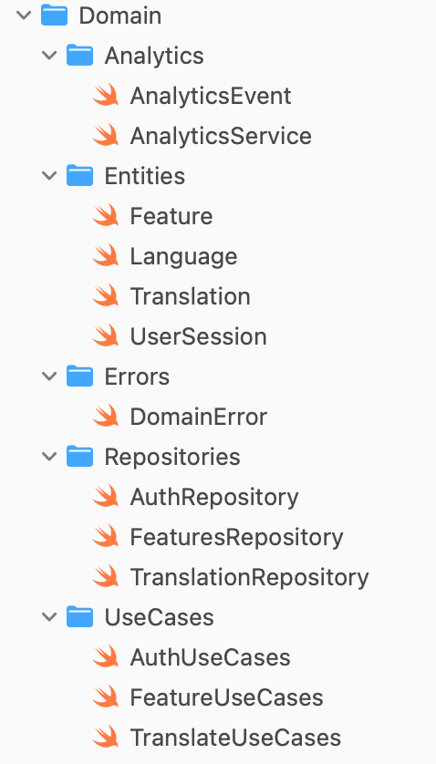
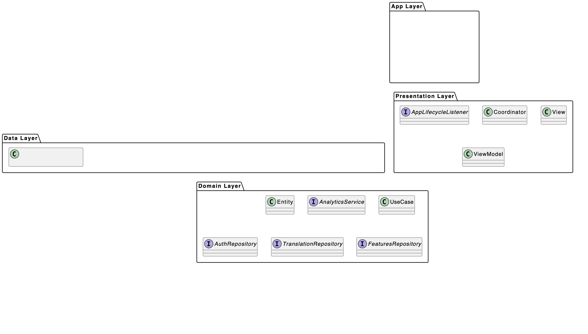

# Transtalor

## Архитектура

**Выбрана:** MVVM + Coordinator + Clean Architecture

**Обоснование:**
- Чёткое разделение ответственности между слоями (Presentation, Domain, Data)
- Высокая тестируемость благодаря протоколам и внедрению зависимостей
- UIKit изолирован в Presentation слое
- Навигация вынесена в Coordinator, освобождая ViewController от этой задачи
- Domain слой не зависит от внешних фреймворков
- Легко масштабировать и поддерживать

---

## Модули

| Модуль | Ответственность |
|--------|------------------|
| **Auth** | Авторизация пользователя и восстановление сессии |
| **Features** | Отображение списка доступных функций переводчика |
| **Translate** | Перевод текста, управление историей и избранным |

---

## Экраны

### Auth

**Вход:**  
**Выход:** `onAuthorized(UserSession)`

**Сценарии:**
- Ввод email/password → успех → переход к списку фич
- Ошибка авторизации → отображение ошибки
- Восстановление сессии при запуске

---

### Features

**Вход:** `UserSession`  
**Выход:** `openFeature(FeatureType)`

**Сценарии:**
- Загрузка списка доступных фич
- Обработка offline-доступности
- Выбор фичи → переход к Translate

---

### Translate

**Вход:** `UserSession`, `FeatureType`  
**Выход:** `close`

**Сценарии:**
- Ввод текста → перевод → отображение результата
- Offline перевод при отсутствии сети
- Сохранение перевода в историю
- Отмена async задач при уходе в background

---

## Ключевые протоколы и модели

## Диаграмма зависимостей модулей

